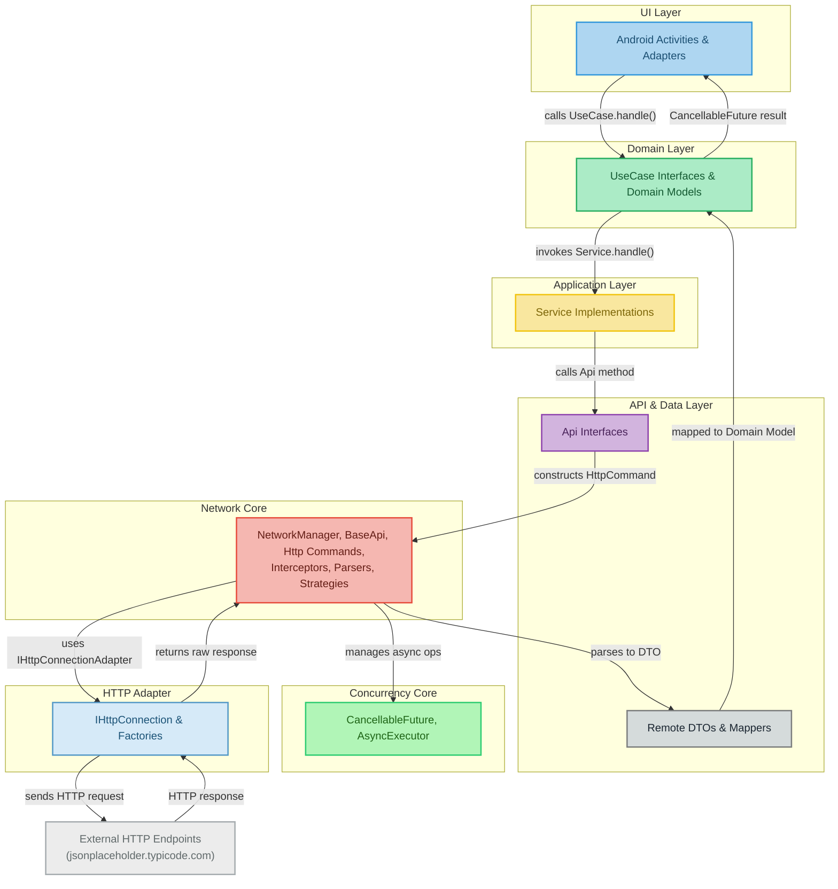

# CleanNetKit

> A clean, testable, and production-ready **Network Layer for Android** — built on SOLID principles, CQRS-style use cases, and cancellable futures.

[](#)
[](#)
[](#license)
[](#)

**Why CleanNetKit?**
It brings structure to Android networking: explicit commands (GET/POST/PUT/PATCH/DELETE), retry policies, pluggable strategies, and clear separation of concerns. You get **Room-like ergonomics** but for network APIs.

---

## Table of Contents

* [Highlights](#highlights)
* [Quick Start](#quick-start)

  * [1) Configure NetworkManager](#1-configure-networkmanager)
  * [2) Define APIs](#2-define-apis)
  * [3) Use Cases & Services](#3-use-cases--services)
  * [4) Call from UI](#4-call-from-ui)
* [Error & Retry Handling](#error--retry-handling)
* [Cancellable Futures](#cancellable-futures)
* [Upload Support](#upload-support)
* [Backoff & Rate Limiting](#backoff--rate-limiting)
* [Strategies Explained](#strategies-explained)
* [Architecture Overview](#architecture-overview)
* [Clean Architecture Integration](#clean-architecture-integration)
* [FAQ](#faq)
* [License](#license)

---

## Highlights

* **Command Pattern**: `HttpGet`, `HttpPost`, `HttpPut`, `HttpDelete`, `HttpMultipartUpload`.
* **CancellableFuture<T>**: Compose like `CompletableFuture`, cancel at will.
* **Retry & Backoff**: Multiple strategies (Exponential, Jitter, CircuitBreaker, Payload-aware).
* **Interceptors**: Logging, Auth, Idempotency headers, custom.
* **Response Parsing**: Pluggable (default: Gson, passthrough for raw strings).
* **Service Layer**: Each domain use case (e.g., `CreateTodoUseCase`) mapped to a `Service` implementation.
* **UI Ready**: Main-thread callbacks, cancel in `onDestroy`.
* **Upload**: Multipart file + fields, payload-sensitive retry policy.

---

## Quick Start

### 1) Configure NetworkManager

```java
NetworkManager nm = new NetworkManager.Builder()
    .factory(new HttpUrlConnectionFactory())
    .parser(new GsonResponseParser())
    .addInterceptor(new LoggingInterceptor())
    .threadPoolSize(4)
    .queueCapacity(8)
    .build();
```

### 2) Define APIs

```java
public class TodoApi extends BaseApi {
    private static final String BASE_URL = "https://jsonplaceholder.typicode.com";

    public TodoApi(NetworkManager nm) { super(BASE_URL, nm); }

    public CancellableFuture<TodoDto> getTodoById(int id) {
        HttpGet cmd = new HttpGet("/todos/" + id, null, null);
        return send(cmd, TodoDto.class);
    }
}
```

### 3) Use Cases & Services

```java
public interface GetTodoUseCase {
    CancellableFuture<Todo> handle(Command c);
    class Command { public final int id; public Command(int id){ this.id = id; } }
}

public class GetTodoService implements GetTodoUseCase {
    private final TodoApi api;
    public GetTodoService(NetworkManager nm){ this.api = new TodoApi(nm); }
    @Override public CancellableFuture<Todo> handle(Command c){
        return api.getTodoById(c.id).thenApplyC(TodoMapper::toDomain);
    }
}
```

### 4) Call from UI

```java
NetworkManager nm = MyApplication.getNetworkManager();
GetTodoService svc = new GetTodoService(nm);

CancellableFuture<Todo> f = svc.handle(new GetTodoUseCase.Command(1));
f.thenAccept(todo -> {
    tvStatus.setText("Loaded: " + todo);
}).exceptionally(ex -> {
    tvStatus.setText("Error: " + ex.getMessage());
    return null;
});
```

Cancel easily in `onDestroy`:

```java
@Override protected void onDestroy(){
    if (f != null) f.cancel(true);
    super.onDestroy();
}
```

---

## Error & Retry Handling

* Retry on **408/429/5xx** by default.
* Pluggable retry policies: `ExponentialBackoff`, `FullJitterBackoff`, `RateLimitAwareRetryPolicy`, etc.
* Customize per-command:

```java
HttpPost cmd = new HttpPost("/todos", body, null)
    .withRetryPolicy(new PayloadSensitiveRetryPolicy(body.length(), 2));
```

---

## Cancellable Futures

* Drop-in replacement for `CompletableFuture` with cancellation propagation.
* `thenApplyC`, `thenComposeC` keep cancellation chain intact.

---

## Upload Support

```java
HttpMultipartUpload upload = new HttpMultipartUpload("/profile");
upload.addFile("avatar", file);
upload.addField("userId", "42");

CancellableFuture<UploadResponse> up = nm.execute(upload, UploadResponse.class);
```

Payload-sensitive retry policy ensures large uploads are never retried blindly.

---

## Backoff & Rate Limiting

* Backoff strategies: Fixed, Exponential, Full/Equal/Decorrelated Jitter, Fibonacci.
* Rate-limit aware: respect `Retry-After` headers.
* Queue-aware: delay based on system load.

---

## Strategies Explained

Strategies define **how the network layer decides to retry, delay, or drop a request**. CleanNetKit includes:

* **FixedBackoff**: Always wait a constant duration (e.g., 2s) between retries.
* **ExponentialBackoff**: Double the delay after each retry (1s → 2s → 4s → 8s).
* **FibonacciBackoff**: Delay grows following Fibonacci numbers (1s → 1s → 2s → 3s → 5s).
* **Jitter Variants**:

  * *FullJitter*: random delay in `[0, base*2^attempt]`.
  * *EqualJitter*: average between exponential and random.
  * *DecorrelatedJitter*: random spread, avoids thundering herd.
* **PayloadSensitiveRetryPolicy**: Don’t retry large uploads blindly; configurable cutoff size.
* **RateLimitAwareRetryPolicy**: Looks for `429` responses and honors `Retry-After` header.
* **CircuitBreakerPolicy**: Temporarily blocks requests to an endpoint if too many failures occur, resets after cooldown.
* **QueueAwareStrategy**: Introduces delay based on system load and queue capacity.

You can also **compose strategies** (e.g., exponential backoff with jitter + rate-limit awareness).

```java
RetryPolicy policy = new RateLimitAwareRetryPolicy(
    new FullJitterBackoff(Duration.ofSeconds(1), Duration.ofSeconds(30))
);
```

### Summary Table

| Strategy                    | Behavior                                 | When to Use                                   |
| --------------------------- | ---------------------------------------- | --------------------------------------------- |
| FixedBackoff                | Constant delay between retries           | Simple cases, predictable timing              |
| ExponentialBackoff          | Delay doubles each retry                 | Network errors, transient outages             |
| FibonacciBackoff            | Delay grows by Fibonacci sequence        | Moderate growth with less aggressiveness      |
| FullJitter                  | Random delay up to exponential cap       | Avoid synchronized retry spikes               |
| EqualJitter                 | Mix of exponential and random            | Balanced retry distribution                   |
| DecorrelatedJitter          | Randomized spread per attempt            | Large systems, reduce thundering herd effect  |
| PayloadSensitiveRetryPolicy | Skips retries for large payloads         | File uploads, large POST bodies               |
| RateLimitAwareRetryPolicy   | Honors `Retry-After` header              | APIs with rate limits (e.g., 429 responses)   |
| CircuitBreakerPolicy        | Opens circuit after consecutive failures | Protect systems from overload, cascading fail |
| QueueAwareStrategy          | Adjusts based on queue/system load       | Prevents overload under heavy traffic         |

---

## Architecture Overview



---

## Clean Architecture Integration

* **Domain**: `UseCase` interfaces (e.g., `GetTodosUseCase`).
* **Application**: Service implementations (bridge domain ↔ API).
* **Infrastructure**: Network layer (`NetworkManager`, commands, strategies).
* **UI**: Activities/Fragments call services, cancel on lifecycle events.

---

## FAQ

**Q: Is it tied to OkHttp?**
A: No. Any `IHttpConnectionFactory` works (`HttpUrlConnectionFactory`, `HttpsConnectionAdapter`, etc.).

**Q: Does it work with coroutines/RxJava?**
A: Futures integrate easily via adapters.

**Q: How to add auth headers?**
A: Use `AuthRequestConfigurator` or a custom `Interceptor`.

---

## License

MIT License. See [LICENSE](LICENSE).

---
